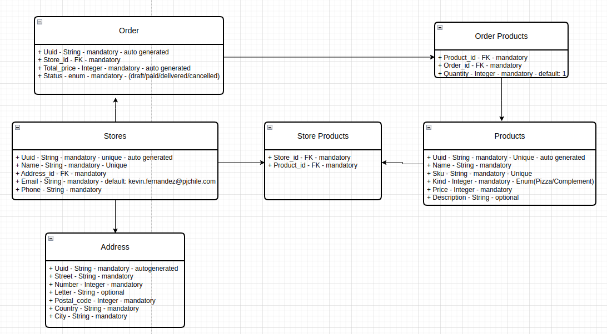

# PJ API

## Descripción

API para realizar la gestión de las tiendas, productos y pedidos.

## Diagrama de base de datos



Explico un poco por encima el diagrama:

- `Stores`: Tiendas.
- `Addresses`: Dirección de la tienda.
- `Products`: Productos.
- `StoreProducts`: Productos de la tienda.
- `Orders`: Pedidos.
- `OrderProducts`: Productos del pedido.

En todos los objetos se tiene un campo `uuid` que es el identificador único de cada objeto. De esta forma evitamos tener que exponer el id de cada objeto en la API.

Comento algunos cambios realizados en algunos objetos:

- `Stores`:
  - Añadido un campo `address_id` para almacenar la dirección de la tienda. Y separar la dirección en un objeto aparte.
- `Orders`:
  - Añadido una máquina de estados para el estado del pedido. La comento un poco más abajo.
- `Addresses`:
  - Añadido todos los campos necesarios para la dirección.
- `OrderProducts`:
  - Añadido un campo `quantity` para almacenar la cantidad de un producto en el pedido.
- `Products`:
  - Añadido un campo `description` para almacenar la descripción del producto.

## Máquina de estados del pedido

La máquina de estados del pedido es una máquina de estados con 3 estados:

- `draft`: Borrador.
  - Permite al usuario realizar ediciones sobre el pedido. Agregar o quitar productos y modificar la cantidad de los productos.
- `paid`: Pagado.
  - Confirma el pago del pedido. Se comenzaría a generar la orden de compra.
- `delivered`: Entregado.
  - Confirma la entrega del pedido.
- `cancelled`: Cancelado.
  - Confirma el cancelamiento del pedido.


## Gemas utilizadas

- `rspec-rails`: Para los tests.
- `factory_bot_rails`: Para la creación de datos de prueba.
- `faker`: Para la generación de datos de prueba.
- `database_cleaner`: Para la limpieza de la base de datos durante los tests.
- `rswag`: Para la generación de la documentación de la API con Swagger.
- `simplecov`: Para el coverage de la API.
- `aasm`: Para la máquina de estados.
- `blueprinter`: Para la serialización de los datos.

## Flujo

1. Se crea una tienda con su dirección.
2. Se crea un producto.
3. Se asigna uno o más productos a la tienda.
4. Se crea un pedido con productos y sus cantidades.
5. Se confirma el pago del pedido.
6. Se confirma la entrega del pedido.

## Recursos

### Postman

En el directorio `docs` se encuentra el archivo `PJ_API.postman_collection.json` que es la colección de Postman con todos los endpoints de la API. Se puede importar en Postman y probar los endpoints.

### Swagger

Os dejo el enlace a la documentación de la API con Swagger: [Swagger](https://pj-api-staging.onrender.com/api-docs/index.html)

### Coverage

Cada vez que corremos los tests, se genera un coverage. El comando es el siguiente:

```bash
bundle exec rspec --exclude-pattern "spec/requests/**/*_spec.rb"
```

Y se genera un archivo en el directorio `coverage` con el coverage de la API. Solo tienes que abrir el archivo `index.html` en el navegador.

### Comandos

Enlace al archivo de comandos: [Comandos](./docs/dev/commands.md)


